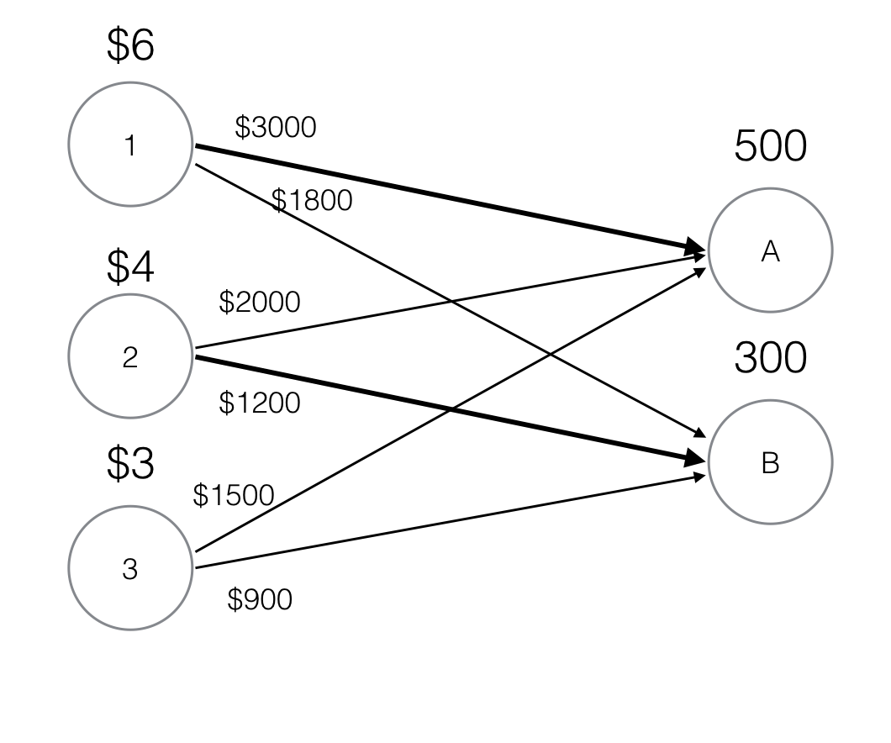

#Networked Life

#####Glen Choo 1000472
#####Loo Juin 1000546
#####Tan Hao Qin 1000521

####**Exercise 1**
*a*


*b*
1 $\rightarrow$ A
Price charged: $\$2000$
Payoff: $\$3000 - \$2000 = \$1000$

2 $\rightarrow$ B
Price charged: $\$900$
Payoff: $\$1200 - \$900 = \$300$

####**Exercise 2**. eBay auction (exercise 2.2 in book)
#####Alice lists a lamp for sale on eBay via auction with both the start price and reserve price set to $7.00 and a duration of 5 days. 
#####The minimal increment is $0.25 and the following events happen during the auction:
- Day 1 Bidder 1 uses a proxy agent, setting the maximum bid up to $11.00. 
- Day 2 Bidder 2 bids $9.25.
- Day 3 Bidder 3 uses a proxy agent, setting the maximum bid up to $17.25. 
- Day 4 Bidder 2 bids $13.65.
- Day 5 Bidder 1 bids $27.45.
#####List the bidding history of all three bidders over each day of the auction. Who is the winner and what price does she pay?

####Day 1

Bidder 1 uses proxy agent. Agent bids $7.00 on Bidder 1's behalf.

Ask price becomes $7.25

####Day 2

Bidder 2 bids $9.25

Ask price becomes $7.50

Bidder 1's agent bids $9.50 since it does not exceeded the maximum bid

Ask price becomes $9.75

####Day 3

Bidder 3 starts agent. Bidder 1 and Bidder 3 agents outbid each other until Bidder 1 reaches maximum bid value. 

Bidder 3 agent then bids $11.25

Ask price becomes $11.50

####Day 4

Bidder 2 bids $13.65

Ask price becomes $11.75

Bidder 1's agent bids $13.90 since it does not exceed the maximum bid

Ask price becomes $14.15


####Day 5

Bidder 1 bids $27.45

Ask price becomes $14.40

Bidder 3's agent keeps bidding until the ask price exceeds its maximum bid

Ask price becomes $17.40

#### End

Bidder 1 wins and pays $17.40

$$\begin{array}{cccccc}\hline
&\text{Day 1}&\text{Day 2}&\text{Day 3}&\text{Day 4}&\text{Day 5}
\\\hline
\text{Bidder 1}&$7.00&$9.50&$11.00&$11.00&$27.45\\
\text{Bidder 2}&-&$9.25&$9.25&$13.65&$13.65\\
\text{Bidder 3}&-&-&$11.25&$13.90&$16.90\\
\text{Ask Price}&$7.25&$9.75&$11.50&$14.15&$17.40\end{array}$$

####**Exercise 3**

####Part a

Let $P_i$ represent Alice's payoff in case $i$.

**Case 1**: $b_1 = r, b_1 > b_2$
$$P_1 = 500(r - b_2)$$

**Case 2**: $b_1 = r, b_2 > b_1$
$$P_2 ≤ 300r$$

**Case 3**: $b_1 > r, b_1 > b_2$
$$P_3 = 500(r - b_2)$$

**Case 4**: $b_1 > r, b_1 > b_2 > r$
$$P_4 = 500(r - b_2) < 0$$

**Case 5**: $b_1 > r, b_2 > b_1$
$$P_5 ≤ 300r$$

**Case 6**: $b_1 < r, b_1 > b_2$
$$P_6 = 500(r - b_2)$$

**Case 7**: $b_1 < r, b_1 < b_2$
$$P_7 ≤ 300r$$

####Part b

Alice's dominant strategy is to tell the truth, i.e., $b_1 = r$. This is because she will not know $b_2$, and if $b_1 ≠ r$, there is a chance that she will make a loss. If $b_1 = r$, there is no chance for Alice to make a loss.

####**Exercise 4**
*a*
Bidder 1 knows that in order to make a gain, she has to win both seats, but not only one seat as that payoff is negative. In order to do that, she must exceed Bidder 2's valuation of a single seat ($\$10$) for both seats. However, since she cannot bid more than $\$15 / 2 = \$7.5$ for both seats, it would be more profitable for her to abstain from bidding altogether than to try (Bidder 1 is a busy woman) or to win only one seat (as that would result in a negative payoff). 

Bidder 1 would thus avoid the auction altogether and Bidder 2 would win both seats at the lowest possible price, the start price plus the minimum increment, which are both assumed to be $0$.

Bidder 2 wins both seats with a bid of $\$0$, pays nothing and gets a payoff of $\$12$.

If Bidder 1 is the kind of person who likes to see others lose money however, she would bid up to $\$2$ for each seat. As Bidder 2 is not willing to bid more than that amount for a second seat, Bidder 1 avoids paying for an unwanted seat but still reduces the payoff for Bidder 2.

In this scenario, Bidder 2 still wins both seats, but pays $\$4$ and receives a payoff of $\$8$.

*b*
In the first scenario, Bidder 1 knows she cannot win any seats and would rather avoid the possibility of having only one seat and getting a negative payoff. 

However, if package bidding is used, since Bidder 1 has a higher valuation of both seats together than Bidder 2, Bidder 1 can win both seats by bidding higher than Bidder 1's valuation of both seats.

In this scenario, Bidder 1 would win with a bid of $\$12$ for both seats, pay $\$12$ and get a payoff of $\$3$.

####**Exercise 5**. VCG auction
#####Find the prices obtained by a VCG mechanism for the bidders and items below (the numbers above the edges are the bidders’ valuations).

$$\begin{array}{|c|ccccc|}\hline
v_{ij}&j=1&j=2
\\\hline
i=1&10&2\\
i=2&3&8\\
i=3&5&6\\
i=4&7&9\\
\hline\end{array}$$

Maximise $\sum_{(ij)}v_{ij}$

Best matching obtained is given by [(1,1),(4,2)], with a valuation of 10 + 9 = 19

$V = v_{ij} - \hat V_{i \leftarrow j} = 19$

Without bidder 1, the best matching is given by [(2,2),(4,1)], with a valuation of 8 + 7 = 15. This implies that 

- bidder 1 has caused bidder 2 $8 worth of damage 
- bidder 1 has caused bidder 4 $-2 worth of damage

$\hat V_{1 \leftarrow 1} = 19 - 10 = 9$

$p_{11} = V_{no\ 1} - \hat V_{1 \leftarrow 1} = 15 - 9 = 6 = 8 + -2$

As such, bidder 1 would have to pay $6.

Without bidder 4, the best matching is given by [(1,1),(2,2)], with a valuation of 10 + 8 = 18. This implies that 

- bidder 4 has caused bidder 2 $8 worth of damage 

$\hat V_{1 \leftarrow 1} = 19 - 9 = 10$

$p_{42} = V_{no\ 1} - \hat V_{1 \leftarrow 1} = 18 - 10 = 8 = 8$

####**Exercise 6**
$$H =
\begin{pmatrix}0&1&0&0\\0&0&1&0\\0&0&0&1\\1&0&0&0\end{pmatrix}$$

Performing 10 iterations:
$\pi[0] = \begin{bmatrix}0.500&0.500&0.000&0.000\end{bmatrix}^T$
$\pi[1] = \begin{bmatrix}0.000&0.500&0.500&0.000\end{bmatrix}^T$
$\pi[2] = \begin{bmatrix}0.000&0.000&0.500&0.500\end{bmatrix}^T$
$\pi[3] = \begin{bmatrix}0.500&0.000&0.000&0.500\end{bmatrix}^T$
$\pi[4] = \begin{bmatrix}0.500&0.500&0.000&0.000\end{bmatrix}^T$
$\pi[5] = \begin{bmatrix}0.000&0.500&0.500&0.000\end{bmatrix}^T$
$\pi[6] = \begin{bmatrix}0.000&0.000&0.500&0.500\end{bmatrix}^T$
$\pi[7] = \begin{bmatrix}0.500&0.000&0.000&0.500\end{bmatrix}^T$
$\pi[8] = \begin{bmatrix}0.500&0.500&0.000&0.000\end{bmatrix}^T$
$\pi[9] = \begin{bmatrix}0.000&0.500&0.500&0.000\end{bmatrix}^T$
$\pi[10] = \begin{bmatrix}0.000&0.000&0.500&0.500\end{bmatrix}^T$

Using this initialisation, there will never be convergence, even as $k$ grows infinitely large.

Obvious solution is:
$\pi^* = \begin{bmatrix}0.25&0.25&0.25&0.25\end{bmatrix}^T$

####**Exercise 7**

```
from __future__ import division
import numpy

N = 5
H_LIST = [[0,1,0,0,0],
	[1,0,0,0,0],
	[1/3,0,1/3,0,1/3],
	[0,0,1/2,0,1/2],
	[0,0,0,0,0]]

ZERO_ROW = numpy.matrix([0,0,0,0,1]).T
THETAS = [0.1,0.3,0.5,0.85]
THRESHOLD = 1E-40
START = 1/N * numpy.ones(5)

H = numpy.matrix(H_LIST)
H_hat = H + (1/N) * ZERO_ROW * numpy.ones(5)

for theta in THETAS:
	print "theta = " + str(theta)
	G = theta * H_hat + (1 - theta) * (1/N) * numpy.ones((5,5))
	pi_old = START * G
	pi_new = pi_old * G
	counter = 0
	while abs(numpy.sum(pi_old - pi_new)) > THRESHOLD:
		pi_old = pi_new
		pi_new = pi_old * G
		counter += 1
	pi_list = pi_new[0].tolist()[0]
	print "pi = " + str([round(el, 5) for el in pi_list])
	sorted_pi_list = sorted(list(enumerate(pi_list)), key=lambda x: x[1], reverse=True)
	print "ranking = " + str([el[0] + 1 for el in sorted_pi_list])
	print "--------------------\n"

```

Rounded to 3 decimal places,

$\theta = 0.1:$
$$\pi^* =  [0.211, 0.205, 0.2, 0.184, 0.2]\\
Ranking: 1, 2, 3, 5, 4
$$

$\theta = 0.3:$
$$\pi^* = [0.238, 0.223, 0.194, 0.152, 0.194]\\
Ranking: 1, 2, 3, 5, 4
$$

$\theta = 0.5:$
$$\pi^* = [0.275, 0.255, 0.176, 0.118, 0.176]\\
Ranking: 1, 2, 3, 5, 4
$$

$\theta = 0.85:$
$$
\pi^* = [0.394, 0.38, 0.09, 0.045, 0.09]\\
Ranking: 1, 2, 3, 5, 4
$$

The ranking remains the same, regardless of the choice of $\theta$.

###**Exercise 8**. Block aggregation in PageRank (exercise 3.4 in book)

#####Set θ = 0.85 and start with any normalized initial vector π[0].
#####a) Compute the PageRank vector $[π_A^∗ π_B^∗ ]^T$ of the graph in figure (a) above with $$H = \begin{pmatrix}1&0\\1/3&2/3\end{pmatrix}$$

#####Note the uneven splitting of link weights from node B. This will be useful later in the problem.

Since there is no dangling nodes, $\hat H = H$

$$G = \theta \hat H + (1-\theta) \frac{1}{N}11^T\\
=0.85\begin{pmatrix}1&0\\1/3&2/3\end{pmatrix} +0.15 \begin{pmatrix}1/2&1/2\\1/2&1/2\end{pmatrix}\\
=\begin{pmatrix}0.925&0.075\\0.35833&0.64166\end{pmatrix}$$

Let $\pi[0]^T = [1/2\ \ 1/2]^T$

Since $\pi[i]^T = \pi[i-1]^T*G$, after iterating through the formula starting from i = 0, the pagerank vector converges to a value of $$\pi^*_{AB} = [\pi^*_A\ \pi^*_B]^T = \begin{pmatrix}0.82671998&0.17328002\end{pmatrix}^T$$


#####b) Compute the PageRank vectors $[π_1^∗ π_2^∗]^T $and $[π_3^∗ π_4^∗ π_5^∗]^T$ of the two graphs in figure (b) above.

Graph 1

$$H_{12} = \begin{pmatrix}0&1\\1&0\end{pmatrix}$$

Since there is no dangling nodes, $\hat H_{12} = H_{12}$

$$G_{12} = \begin{pmatrix}0.925&0.075\\0.075&0.925\end{pmatrix}$$

$$\pi^*_{12} = [\pi^*_1\ \pi^*_2]^T =\begin{pmatrix}0.5&  0.5\end{pmatrix}^T$$

Graph 2

$$H_{345} = \begin{pmatrix}1/2&0&1/2\\1/2&0&1/2\\0&0&0\end{pmatrix}$$

$$\hat H_{345} = \begin{pmatrix}1/2&0&1/2\\1/2&0&1/2\\1/3&1/3&1/3\end{pmatrix}$$

$$G_{345} = \begin{pmatrix}0.475&0.05&0.475\\0.475&0.05&0.475\\1/3&1/3&1/3\end{pmatrix}$$

$$\pi^*_{345} = [\pi^*_3\ \pi^*_4\ \pi^*_5]^T =\begin{pmatrix}0.41439815&0.1712037&0.41439815\end{pmatrix}^T$$

#####c) If we divide the graph in exercise 7 into two blocks as shown in the figure below, we can approximate $π^∗$ in the previous question by
$$\hat π^∗ = [π_A^∗ · [π_1^∗ π_2^∗] π_B^∗ · [π_3^∗ π_4^∗ π_5^∗]]^T $$.
#####Compute this vector. Explain the advantage, in terms of computational load, of using this approximation instead of directly computing $π^∗$.

$$\hat π^∗ = [0.82671998 · [0.5\ \ 0.5]\ \ \ 0.17328002 · [0.41439815\ \ 0.1712037\ \ 0.41439815]]^T \\ 
=[0.41335999\ \ 0.41335999\ \ 0.07180691972\ \ 0.02966618056\ \ 0.07180691972]^T$$

The approximation is considerably less computationally expensive as our matrix operations involves matrices of a smaller size. As matrix multiplication of a m * n matrix and a n * p matrix is $O(mnp)$, or in this case $O(n^2)$ since $m = 1$. As the size of matrix increases, the computational power required would increase quadratically.

> Written with [StackEdit](https://stackedit.io/).