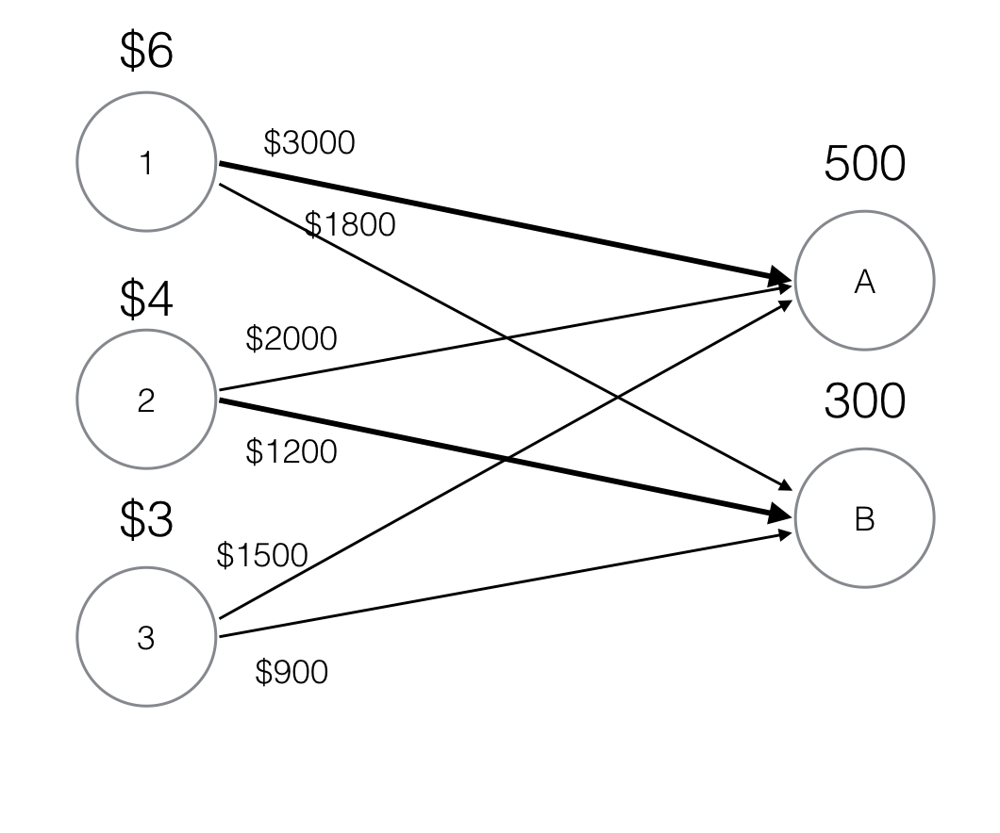

**1**
*a*


*b*
1 $\rightarrow$ A
Price charged: $\$2000$
Payoff: $\$3000 - \$2000 = \$1000$

2 $\rightarrow$ B
Price charged: $\$900$
Payoff: $\$1200 - \$900 = \$300$

**4**
*a*
Bidder 1 knows that in order to make a gain, she has to win both seats, but not only one seat as that payoff is negative. In order to do that, she must exceed Bidder 2's valuation of a single seat ($\$10$) for both seats. However, since she cannot bid more than $\$15 / 2 = \$7.5$ for both seats, it would be more profitable for her to abstain from bidding altogether than to try (Bidder 1 is a busy woman) or to win only one seat (as that would result in a negative payoff). 

Bidder 1 would thus avoid the auction altogether and Bidder 2 would win both seats at the lowest possible price, the start price plus the minimum increment, which are both assumed to be $0$.

Bidder 2 wins both seats with a bid of $\$0$, pays nothing and gets a payoff of $\$12$.

If Bidder 1 is the kind of person who likes to see others lose money however, she would bid up to $\$2$ for each seat. As Bidder 2 is not willing to bid more than that amount for a second seat, Bidder 1 avoids paying for an unwanted seat but still reduces the payoff for Bidder 2.

In this scenario, Bidder 2 still wins both seats, but pays $\$4$ and receives a payoff of $\$8$.

*b*
In the first scenario, Bidder 1 knows she cannot win any seats and would rather avoid the possibility of having only one seat and getting a negative payoff. 

However, if package bidding is used, since Bidder 1 has a higher valuation of both seats together than Bidder 2, Bidder 1 can win both seats by bidding higher than Bidder 1's valuation of both seats.

In this scenario, Bidder 1 would win with a bid of $\$12$ for both seats, pay $\$12$ and get a payoff of $\$3$.

**7**

```
from __future__ import division
import numpy

N = 5
H_LIST = [[0,1,0,0,0],
	[1,0,0,0,0],
	[1/3,0,1/3,0,1/3],
	[0,0,1/2,0,1/2],
	[0,0,0,0,0]]

ZERO_ROW = numpy.matrix([0,0,0,0,1]).T
THETAS = [0.1,0.3,0.5,0.85]
THRESHOLD = 1E-40
START = 1/N * numpy.ones(5)

H = numpy.matrix(H_LIST)
H_hat = H + (1/N) * ZERO_ROW * numpy.ones(5)

for theta in THETAS:
	print "theta = " + str(theta)
	G = theta * H_hat + (1 - theta) * (1/N) * numpy.ones((5,5))
	pi_old = START * G
	pi_new = pi_old * G
	counter = 0
	while abs(numpy.sum(pi_old - pi_new)) > THRESHOLD:
		pi_old = pi_new
		pi_new = pi_old * G
		counter += 1
	pi_list = pi_new[0].tolist()[0]
	print "pi = " + str([round(el, 5) for el in pi_list])
	sorted_pi_list = sorted(list(enumerate(pi_list)), key=lambda x: x[1], reverse=True)
	print "ranking = " + str([el[0] + 1 for el in sorted_pi_list])
	print "--------------------\n"

```

Rounded to 3 decimal places,

$\theta = 0.1:$
$$\pi^* =  [0.211, 0.205, 0.2, 0.184, 0.2]\\
Ranking: 1, 2, 3, 5, 4
$$

$\theta = 0.3:$
$$\pi^* = [0.238, 0.223, 0.194, 0.152, 0.194]\\
Ranking: 1, 2, 3, 5, 4
$$

$\theta = 0.5:$
$$\pi^* = [0.275, 0.255, 0.176, 0.118, 0.176]\\
Ranking: 1, 2, 3, 5, 4
$$

$\theta = 0.85:$
$$
\pi^* = [0.394, 0.38, 0.09, 0.045, 0.09]\\
Ranking: 1, 2, 3, 5, 4
$$

The ranking remains the same, regardless of the choice of $\theta$.